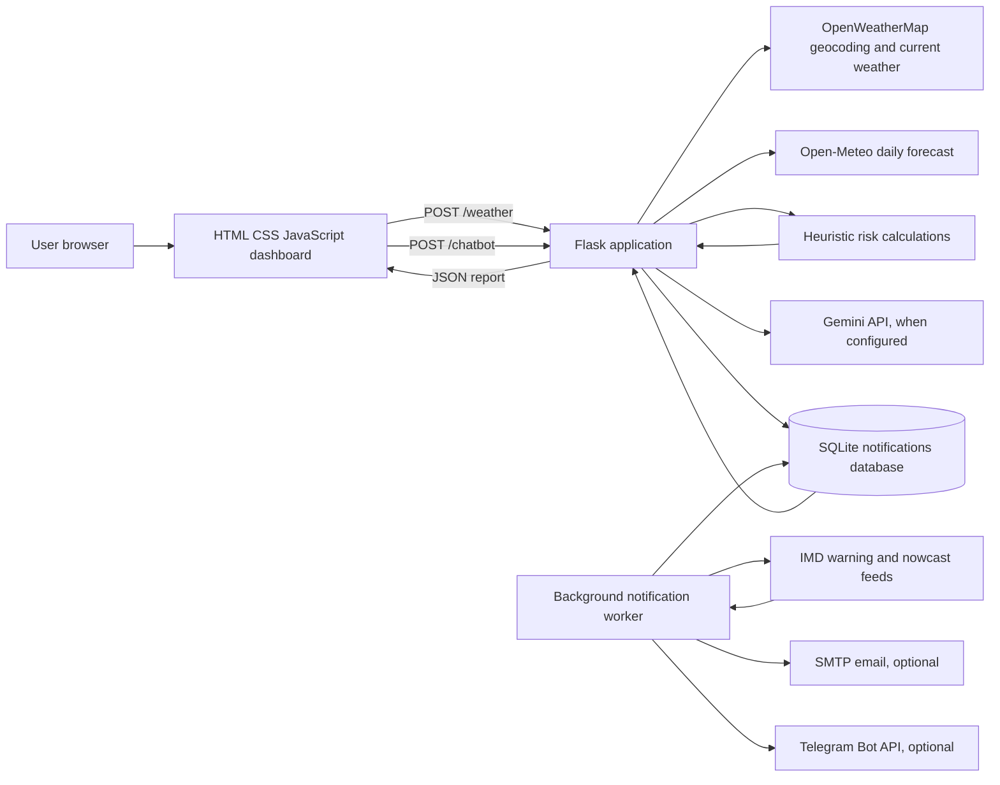
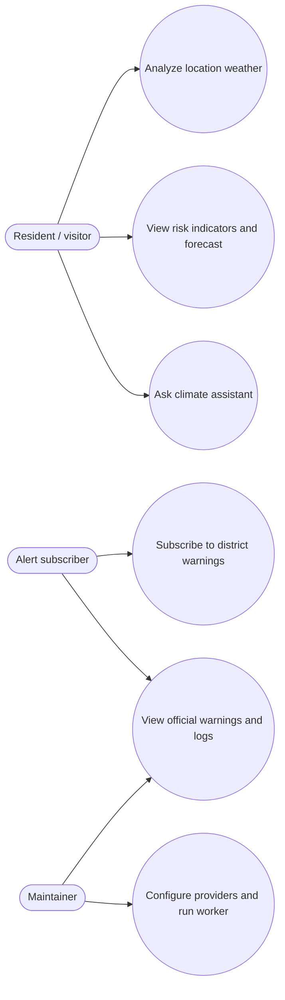
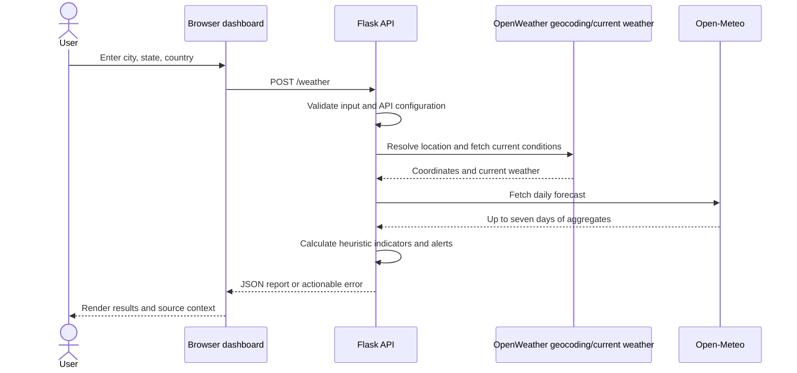
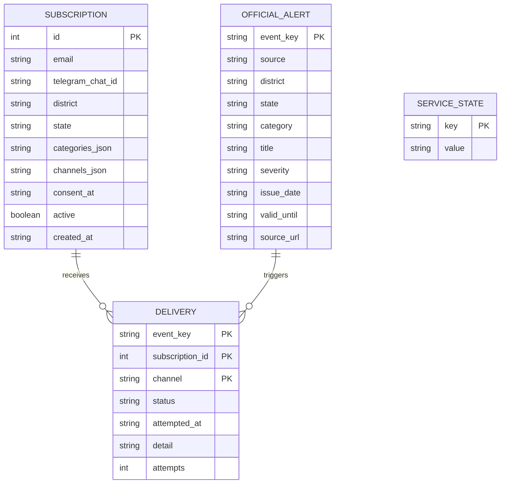

# Disaster Shield — Project PRD

> **Document status:** Academic project requirements and design document based on the repository as inspected on 1 October 2026. This describes the current prototype and a proposed direction; it is not evidence of certified emergency-warning performance. Items marked **TBD** need confirmation by the student team or institution.

## 1. Title

**Project:** Disaster Shield — Location-Based Climate Risk Analysis and Official Weather Alert Platform  
**Students / team:** Team Disaster Shield; individual student names and student IDs: **TBD**  
**Guide / supervisor:** **TBD**  
**College / department:** **TBD**  
**Project type:** Web application / academic prototype  
**Version:** 1.0 (PRD)

## 2. Abstract

Disaster Shield is a web-based climate awareness prototype that brings together location-specific weather information, rule-based hazard indicators, forecast summaries, official India Meteorological Department (IMD) district warnings, configurable email/Telegram subscriptions, and a conversational climate-safety assistant. A user can request an analysis by city, state, and country. The Flask service resolves the location through OpenWeatherMap, retrieves current weather and a seven-day Open-Meteo forecast, calculates bounded heuristic risk scores, and returns results to a responsive HTML/CSS/JavaScript dashboard. Separately, a background worker polls IMD district warning, subdivision warning, and district nowcast feeds, persists events and subscriptions in SQLite, and can deliver matching official warnings through configured SMTP and Telegram Bot API channels. The assistant uses Google Gemini when configured and receives filtered weather/risk context from the application.

The project aims to make weather context and preparedness information easier to access. Its risk formulas are prototype heuristics, not trained or empirically validated prediction models; data availability and alert delivery depend on third-party services and configuration. Official IMD alerts are displayed as a distinct source from application-generated risk advisories. This document records implemented capabilities, functional and quality requirements, system design, evaluation needs, and future work.

## 3. Introduction

Weather hazards can develop quickly, while residents may need to consult multiple sources to understand local conditions and preparedness actions. Disaster Shield provides one interface for exploring current conditions, a short forecast, simple risk indicators, safety information, and (when configured) official district warnings and notifications.

### 3.1 Purpose

This PRD gives students, reviewers, and implementers a shared description of the project’s intended users, scope, requirements, implementation, constraints, and evaluation plan. It can support a project report and presentation, but should be updated with the institution’s required format and verified implementation results before submission.

### 3.2 Intended users

- Residents and students seeking a quick weather and preparedness overview for a chosen location.
- Users subscribing to selected district-level official warnings by email or Telegram, where providers are configured.
- Project evaluators and maintainers reviewing the prototype’s system design and limitations.

### 3.3 Scope

**Current scope:** email/password accounts and login; location-based current weather and seven-day forecast; heuristic indicators for flood, heat, wildfire, cyclone, and short-term hot/dry conditions; dashboard charts and advice; climate-safety assistant; account-owned district/state subscriptions; first and five-day subscription analysis emails; search analysis emails for the signed-in account; IMD feed polling and event storage; optional email/Telegram delivery; service status and account-scoped dispatch logs.

**Out of scope:** official emergency dispatch, evacuation decisions, guaranteed delivery, authoritative hydrological/fire/cyclone prediction, user identity verification, multilingual coverage guarantees, and a production-grade multi-instance notification service.

## 4. Literature Survey

This section frames relevant system approaches rather than claiming a complete academic review. Add institution-approved papers, publication details, and citation style before submission.

| Area | Common approach | Relevance to Disaster Shield | Limitation to address |
|---|---|---|---|
| Weather information services | APIs provide observations and forecast variables through location or coordinate queries. | OpenWeatherMap supplies current conditions; Open-Meteo supplies daily forecast aggregates. | Provider coverage, latency, quotas, definitions, and freshness vary. Show source and observation time. |
| Rule-based risk indicators | Weighted thresholds map weather variables to a score or category. | The backend calculates bounded scores from temperature, rainfall/precipitation, humidity, and wind. | Simple formulas do not establish probability, local vulnerability, or forecast skill. Validate against historical observations and domain expertise. |
| Official warning dissemination | Meteorological agencies issue warnings with hazard, geography, severity, and validity. | The worker consumes IMD district warning, subdivision warning, and nowcast feeds and retains source metadata. | Access, feed schema, coverage, update cadence, and delivery infrastructure are external dependencies. Preserve source identity. |
| Alert subscription and messaging | A backend matches events to user preferences and sends through provider channels. | SQLite stores subscriptions, alerts, delivery status, and service state; SMTP and Telegram Bot API are optional. | Consent, ownership verification, opt-out, retries, duplicate suppression, rate limits, and persistent shared storage matter for production. |
| Conversational assistance | A language model responds to natural-language questions using supplied context and safety instructions. | Gemini receives a filtered report and bounded conversation history; the prompt discourages invented live facts. | Generated advice can still be wrong. It must not replace official instructions or emergency services. |

**Suggested primary references to verify and cite:** official OpenWeather API documentation; Open-Meteo API documentation; IMD API portal and warning documentation; Google Gen AI SDK documentation; Flask documentation; SQLite documentation; Telegram Bot API documentation. Record exact page titles, publisher, access date, and URLs in the final academic reference style. Do not treat product documentation as evidence that the risk model is accurate.

## 5. Existing System and Drawbacks

### 5.1 Existing implementation

The repository contains a Flask application (`backend/alertsystem.py`) that serves the frontend and provides weather, notification, and chatbot endpoints. The analysis page accepts city, state, and country; requests geocoding/current weather from OpenWeatherMap; requests daily forecast data from Open-Meteo; computes five weather-variable heuristics; and renders values, risk labels, recommendations, and forecast views. A separate notification worker polls IMD warning endpoints and stores events in a local SQLite database. Subscriptions can select event categories and channels; delivery code supports SMTP email and Telegram Bot API when credentials are configured. A Gemini-based assistant can receive a sanitized subset of the current report and recent conversation history. Provider credentials are read from environment variables.

### 5.2 Drawbacks and constraints

- The weighted risk formulas and thresholds are heuristic constants, with no documented calibration, training data, uncertainty estimate, or measured predictive performance.
- Current conditions and forecast data come from separate providers and can differ in timing, coverage, or semantics.
- The weather analysis is location-based on a city/state/country lookup, not a fine-grained exposure model; it does not incorporate terrain, drainage, population vulnerability, or local infrastructure.
- The notification database defaults to a local SQLite file. The README identifies shared persistent storage as necessary before multi-instance public deployment.
- The IMD worker must be run separately and requires authorized feed access. Email and Telegram depend on external provider credentials; Telegram users must start a chat with the bot first.
- The repository documentation calls the chatbot rule-based in one section, while the implementation uses Gemini. Documentation should consistently describe the actual AI integration and its configuration dependency.
- Subscription email/Telegram ownership verification, a robust unsubscribe flow, and rate limiting are not documented as implemented; the README identifies these as pre-deployment work.
- External API failure, absent credentials, stale feeds, or network loss can prevent results or delivery. The product must expose failures and data freshness clearly.
- No benchmark results, model evaluation dataset, uptime target, accessibility audit, or user study was found in the repository. Those results must be measured rather than invented.

## 6. Problem Statement and Objectives

### 6.1 Problem statement

Users may have difficulty assembling local weather context, understanding what simple weather indicators imply, and finding matching official district warnings in one accessible interface. Disaster Shield addresses this usability problem with a unified prototype, while preserving the distinction between heuristic advisories and official warnings.

### 6.2 Objectives

1. Let a user request an analysis for a named location with clear input validation and actionable error states.
2. Present current conditions and a seven-day forecast with units, location, source context, and freshness where available.
3. Compute and display five bounded, explainable heuristic indicators and preparedness suggestions.
4. Display official IMD warnings separately, with hazard, severity, geography, validity/source details where supplied.
5. Allow a user to consent to district/category/channel subscriptions and record delivery outcomes.
6. Provide a conversational assistant that uses available report context, avoids fabricating live measurements, and directs emergency situations to official authorities.
7. Document limitations and collect reproducible evaluation evidence before making accuracy or performance claims.

### 6.3 Success criteria (to measure)

- Valid location analysis returns structured weather, forecast, risk, and alert data; invalid or unavailable requests return understandable errors.
- Each displayed risk indicator can be traced to documented input variables and formula.
- IMD warnings remain distinguishable from model-generated advisories and link to their originating feed where possible.
- Configured notification flows log success/failure and suppress duplicate event deliveries according to event/subscription/channel identity.
- Evaluation records response latency, provider failure behavior, usability findings, and—if claiming predictive skill—validation against a labelled historical dataset.

Numerical targets (latency, availability, accuracy, satisfaction) are **TBD** pending project requirements and measurement; no target is implied here.

## 7. Proposed System

The proposed system retains the implemented web prototype and strengthens its treatment of provenance, usability, reliability, and evaluation. Users enter a location, review current conditions and forecast data, inspect clearly labelled advisory scores, and consult the assistant. A separate official-warning panel shows IMD-sourced events. A subscription form records consent and event/channel preferences; the worker matches newly observed official events to subscriptions and attempts configured deliveries.

### 7.1 Functional requirements

| ID | Requirement | Priority |
|---|---|---|
| FR-01 | Accept city, state, and country and reject missing fields. | Must |
| FR-02 | Resolve the requested location and return current weather in metric units. | Must |
| FR-03 | Retrieve and display daily forecast information for up to seven days. | Must |
| FR-04 | Calculate five bounded hazard indicators and identify them as heuristic advisories. | Must |
| FR-05 | Generate risk-specific safety suggestions and a no-major-indicator state. | Should |
| FR-06 | Retrieve and display matching official IMD district warnings and service status. | Must, when feed configured |
| FR-07 | Register and log in with a unique email and password; require an authenticated session for app features and scope subscriptions/logs to the account. | Must |
| FR-08 | Save a subscription with district, state, categories, chosen channels, and explicit consent; send the first analysis on signup and repeat email analyses every five days. | Must |
| FR-09 | Email each successful location search to the signed-in account when email delivery is enabled for a subscription. | Should |
| FR-10 | Poll official feeds on a configurable interval and persist warning and delivery records. | Must, when worker/feed configured |
| FR-11 | Attempt email/Telegram delivery only for configured channels and record outcomes/retries. | Should |
| FR-12 | Answer chatbot questions, using sanitized report context when supplied, and return a clear unavailable/error state. | Should |
| FR-13 | Show provider/worker failure and stale/unavailable status without implying that no hazard exists. | Must |

### 7.2 Non-functional requirements

- **Usability:** responsive layouts, readable labels, units, clear loading/error/empty states, and keyboard-operable controls.
- **Reliability:** finite network timeouts, graceful dependency failures, persisted notification history, and duplicate-aware delivery behavior.
- **Security/privacy:** keep API and messaging credentials server-side; collect only subscription data needed for delivery; obtain consent; define retention and deletion; add verification, unsubscribe, and rate limits before production.
- **Performance:** document API and page response measurements under an agreed test setup; avoid claiming an unmeasured SLA.
- **Maintainability:** keep data acquisition, risk calculations, notification processing, and presentation separable; document provider contracts and configuration.
- **Safety:** label source, timestamp, and advisory status; do not present the prototype as a certified warning authority; direct users to official emergency instructions.

### 7.3 Key user stories

- As a resident, I want to enter my location and understand current weather and possible hazard indicators so that I can prepare appropriately.
- As a resident, I want to see official district warnings separately from computed scores so that I can identify authoritative alerts.
- As a subscriber, I want to choose relevant warning categories and delivery channels with consent so that I receive notifications that match my preferences.
- As a user, I want to ask a safety question in plain language and receive context-aware guidance with clear limitations.
- As a maintainer, I want to see feed/worker status and delivery logs so that I can diagnose unavailable integrations.

## 8. System Architecture

**Runtime components:** browser client; Flask web/API process; independently run notification worker; SQLite database; external geocoding/weather/forecast/IMD/LLM/messaging services. Secrets are configured through environment variables (for example `OPENWEATHER_API_KEY`, `IMD_API_KEY`, `GEMINI_API_KEY`, `TELEGRAM_BOT_TOKEN`, and SMTP settings). Deployment configuration in the repository starts the Flask service with Gunicorn; the README’s notification instructions require a separate worker process. Local SQLite is suitable for a prototype but needs shared persistent storage or a managed database for scaled deployment.

## 9. Methodology / Algorithm

### 9.1 Weather analysis flow

1. Validate that city, state, and country are present.
2. Geocode with OpenWeatherMap using the configured API key; return a location error if no match is found.
3. Retrieve current conditions from OpenWeatherMap in metric units. Convert wind speed from m/s to km/h; use available one-hour or three-hour rain amount, otherwise zero.
4. Retrieve up to seven daily aggregates from Open-Meteo for the resolved coordinates.
5. Compute each score, rounding to three decimals and capping at 1.0:

Let `T` be temperature in °C, `H` relative humidity in percent, `R` rain amount in the current-weather response (or daily precipitation sum for forecast), and `W` wind speed in km/h.

| Indicator | Implemented score formula |
|---|---|
| Flood | `min(1, (0.6R + 0.3H + 0.1W) / 100)` |
| Heat | `min(1, (2 max(T − 25, 0) + 0.3H) / 100)` |
| Wildfire | `min(1, (1.5 max(T − 32, 0) + 0.5(100 − H) + 0.2W) / 100)` |
| Cyclone | `min(1, (1.5W + 0.5R) / 100)` |
| Short-term hot/dry conditions | `min(1, (max(T − 28, 0) + (100 − H)) / 100)`; this is not a drought assessment |

6. Generate backend alert strings when a score reaches its implemented alert threshold (`0.6`); return a no-major-threat message if none crosses it. Thresholds/weights are software constants, not validated warning criteria. Forecast scores use daily aggregates, with maximum temperature for heat-related terms.
7. Return location, weather, forecast, scores, and generated alerts to the frontend for visualization and advice.

**Interpretation constraint:** these values are dimensionless rule outputs. They are not calibrated probabilities, official warnings, or evidence that an event will occur. A score should not be called a prediction probability without validation and calibration.

### 9.2 Official notification flow

1. The worker polls the IMD district warning, subdivision warning, and district nowcast endpoints on the configured interval (default 300 seconds; minimum 60 seconds in worker code).
2. It normalizes feed records into hazard, district/state, severity, issue/validity, source URL, and a deterministic event key.
3. It stores active events and compares event keys with known records to identify new events.
4. It matches events to active subscriptions by district/state/category and requested channel.
5. It attempts configured email or Telegram delivery; delivery records capture status, time, detail, and attempts. The README reports up to five retries for failures; verify retry behavior during final demonstration.
6. API endpoints expose matching alerts, subscription logs, and worker/feed configuration status to the dashboard.

### 9.3 Chat assistant flow

The client submits a question and optional current climate report/history. The backend limits question length, filters context fields and bounds history, and calls Gemini with instructions not to invent supplied live facts or claim emergency action. If credentials or the provider are unavailable, it returns an error response. Generated content remains general assistance and must defer emergencies to local authorities.

## 10. UML Diagrams

### 10.1 Use-case diagram

### 10.2 Sequence diagram: location analysis

### 10.3 Data model overview

## 11. Modules

| Module | Main responsibility | Repository location |
|---|---|---|
| Landing/dashboard UI | Project overview, navigation, notification sign-up, assistant widget. | `Frontend/index.html`, `Frontend/script.js`, `Frontend/style.css` |
| Climate analysis UI | Location form, report rendering, risk cards, forecast and charts, alert display. | `Frontend/Analysis/analysis.html`, `Frontend/Analysis/analysis.js`, `Frontend/Analysis/analysis.css` |
| Flask web/API | Serves frontend; handles weather analysis and notification/chat routes. | `backend/alertsystem.py` |
| Weather and scoring | Geocoding, current conditions, forecast integration, formula-based scores and alerts. | `backend/alertsystem.py` |
| Notification service | IMD parsing, SQLite schema, subscription matching, channel delivery, logs/status. | `backend/notification_service.py` |
| Notification worker | Periodic IMD polling and dispatch orchestration. | `backend/notification_worker.py` |
| Climate assistant | Context filtering, Gemini requests, safety instructions, error handling. | `AI-chatbot/chatbot.py` |
| Configuration/deployment | Python dependencies and Render web service setup. | `requirements.txt`, `render.yaml`, environment variables |

## 12. Hardware and Software Requirements

### 12.1 Development/runtime software

- Python 3.10 or later (README requirement), pip, and virtual environment.
- Flask, Flask-CORS, Requests, python-dotenv, Gunicorn, and `google-genai` as listed in `requirements.txt`.
- Modern web browser with JavaScript enabled.
- Node.js/npm only if using the static `npm run dev` helper; the production backend serves the frontend.
- Network access to configured weather, forecast, IMD, Gemini, SMTP, and/or Telegram services.
- Valid provider credentials as applicable: OpenWeatherMap, IMD API access, Gemini, SMTP, Telegram Bot API.

### 12.2 Hardware

The repository specifies no minimum CPU, RAM, disk, or concurrent-user benchmark. A standard development computer capable of running Python and a browser is sufficient for local demonstration. Record actual host/container specifications and storage assumptions for reproducible performance results. Production sizing is **TBD** after load testing.

## 13. Results / Screenshots

**Evidence status:** the repository contains the UI implementation but this PRD author did not capture runtime screenshots or verify live third-party credentials. Do not insert fabricated output or claim a successful live feed. Add dated screenshots from a configured, running application before submission.

Recommended figures for the final report:

1. Landing page showing project navigation and notification sign-up.
2. Analysis page before submission, showing location input.
3. Successful analysis showing units, five risk cards, forecast, and generated recommendations.
4. Official IMD warnings panel showing source/severity and worker status (with a real authorized feed response).
5. Subscription success and a redacted delivery log for a controlled test.
6. Assistant response to a preparedness question with report context (redact keys and personal information).
7. Validation states for missing location, unknown location, and unavailable provider.

For each figure, provide figure number, caption, capture date, configuration, and whether the values are live, mocked, or sample data. Never publish API keys, email addresses, phone numbers, or personal subscription records.

## 14. Performance Comparison

No measured benchmark or validated baseline is present in the repository. Therefore, this section defines a reproducible comparison plan rather than reporting invented results.

| Measure | Baseline to collect | Proposed system to measure | Evidence |
|---|---|---|---|
| Analysis response time | Manual/source-switching workflow, if a fair baseline is defined | Median and 95th percentile `/weather` latency under fixed locations and network conditions | Timestamped repeated trials; report sample count and environment |
| Data completeness | Fields available in selected baseline sources | Fraction of successful responses with required current/forecast fields | Saved sanitized response records; provider error rate |
| Risk-model performance | Simple threshold or historical baseline, if labels are available | Precision, recall, F1, calibration and lead time per hazard on time-separated labelled data | Dataset provenance, split design, confusion matrices, uncertainty intervals |
| Alert delivery | Manual checking or no automated subscription workflow | End-to-end time from feed observation to delivery; success/failure and duplicate rates | Controlled authorized test events and redacted delivery log |
| Usability | Existing workflow assessed with same tasks | Task completion, time, error rate, and participant feedback | Defined tasks, participant count, consent, summary statistics |

Compare like for like: identical locations/time windows, recorded provider conditions, explicit missing-data handling, and reproducible hardware/network. Do not compare the heuristic score directly to an official warning as if they were interchangeable labels. All numeric result cells should remain **TBD** until measurements are collected.

## 15. Conclusion and Future Scope

Disaster Shield combines a browser dashboard, weather/forecast integrations, transparent rule-based indicators, official IMD alert ingestion, optional subscription delivery, and a context-aware conversational assistant. Its current value is in bringing these capabilities into a single educational prototype and clearly presenting multiple sources. The score formulas are simple and interpretable but are not yet shown to predict real-world impacts reliably; official warnings and local authority guidance should take precedence.

Future work should prioritize historical-data validation and domain review of thresholds; richer geographic exposure and uncertainty; source timestamps and stale-data indicators; verified contact ownership and unsubscribe handling; rate limiting and privacy/retention controls; managed shared persistence and robust background-job operations; accessibility and localization; monitoring and load testing; and documented user evaluation. Any expanded hazard prediction should be evaluated separately for each hazard and region before release.

## 16. References

The following are project dependencies and primary documentation starting points. Confirm the pages and record access date in the required institutional citation format before final submission.

1. OpenWeather, **API documentation**: https://openweathermap.org/api
2. Open-Meteo, **Weather Forecast API documentation**: https://open-meteo.com/en/docs
3. India Meteorological Department, **API portal**: https://api.imd.gov.in/public/index.php
4. Google, **Gen AI Python SDK documentation**: https://googleapis.github.io/python-genai/
5. Pallets Projects, **Flask documentation**: https://flask.palletsprojects.com/
6. Python Software Foundation, **sqlite3 — DB-API 2.0 interface for SQLite databases**: https://docs.python.org/3/library/sqlite3.html
7. Telegram, **Bot API documentation**: https://core.telegram.org/bots/api
8. Disaster Shield repository, **README and implementation**: https://github.com/thetechguardians/Disaster-Shield (repository attribution/URL should be checked against the submitted project copy).

## 17. Thank You

**Thank you.**  
*Disaster Shield — improving access to weather context and preparedness information.*

---

### Submission checklist

- Replace **TBD** with verified student, guide, college, department, and academic-year details.
- Confirm which described features run in the final demo and which require unavailable provider access.
- Add authentic dated screenshots and measured results; never present proposed targets as achieved results.
- Verify references and format them using the institution’s citation requirements.
- State clearly that the heuristic risk scores are advisory and are not a substitute for official alerts.
